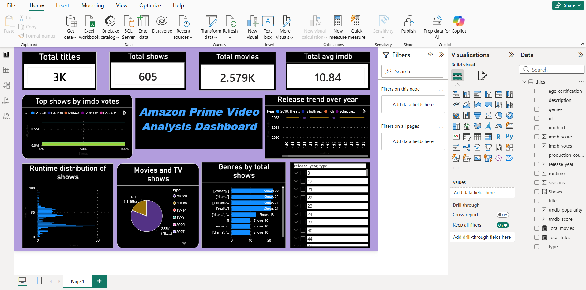

# Amazon Prime Video Content Analysis | EDA & Power BI Dashboard

## Project Overview

This project focuses on analyzing Amazon Prime Video content using **Python for Exploratory Data Analysis (EDA)** and **Microsoft Power BI for interactive dashboard development**.

The analysis explores the platform's content library based on content type, genres, IMDb ratings, IMDb votes, runtime, release years, and country distribution. The findings from the analysis were transformed into meaningful visual insights through an interactive Power BI dashboard.

## Objective

The objective of this project is to analyze Amazon Prime Video content, identify important patterns and trends, and present the findings through data visualization.

The project covers:

- Exploratory Data Analysis of Amazon Prime Video content
- Data cleaning and preparation
- Content type and genre analysis
- IMDb rating and vote analysis
- Release trend analysis
- Runtime distribution
- Country-wise content distribution
- Interactive Power BI dashboard development

## Tools & Technologies

- Python
- Pandas
- NumPy
- Matplotlib
- Seaborn
- Microsoft Power BI
- Data Analysis
- Data Visualization

## Project Workflow

The project follows these major steps:

1. Data collection and preparation
2. Data cleaning and preprocessing using Python
3. Exploratory Data Analysis (EDA)
4. Identification of key trends and insights
5. Data visualization using Python
6. Development of an interactive Power BI dashboard
7. Documentation and presentation of findings

## Exploratory Data Analysis (EDA)

The EDA was performed using Python to understand the Amazon Prime Video dataset and identify meaningful patterns.

### Key EDA Insights

- Analyzed the distribution of movies and TV shows
- Identified the most frequent genres
- Studied IMDb rating distribution
- Analyzed content growth and release patterns over the years
- Explored rating categories such as TV-MA, PG-13, and others
- Examined content distribution across different countries

### Python Libraries Used

- Pandas
- NumPy
- Matplotlib
- Seaborn

## Power BI Dashboard

An interactive Power BI dashboard was developed to present the analysis in a clear and user-friendly format.

### Dashboard Overview

The dashboard includes the following key metrics and visualizations:

- Total Titles
- Total Shows
- Total Movies
- Average IMDb Score
- Top Shows by IMDb Votes
- Release Trend Over the Years
- Runtime Distribution
- Movies and TV Shows Distribution
- Genre-wise Content Analysis
- Release Year and Content Type Filtering

## Key Metrics

- **Total Titles:** 3K
- **Total Shows:** 605
- **Total Movies:** 2.579K
- **Average IMDb Score:** 10.84

## Key Analysis

The analysis provides insights into:

- Distribution of movies and TV shows
- IMDb ratings and votes
- Popular content based on IMDb votes
- Content release trends across different years
- Runtime distribution of available content
- Genre-wise distribution of movies and TV shows
- Country-wise content distribution
- Comparison between movies and TV shows
- Content analysis using release year and content type filters

## Dashboard Preview

## Project Report

[View the detailed project report](Amazon%20Prime%20Video%20Analysis%20Dashboard.pdf)

## Dataset

The datasets used for this project are included in this repository:

- `titles.csv` – Amazon Prime Video titles and content information
- `credits.csv` – Cast and crew information

## Project Files

- `Amazon-Prime-Video-EDA.ipynb` – Exploratory Data Analysis notebook
- `titles.csv` – Amazon Prime Video titles dataset
- `credits.csv` – Cast and crew dataset
- `Amazon-Prime-Video-Dashboard.png` – Power BI dashboard preview
- `Amazon Prime Video Analysis Dashboard.pdf` – Detailed project report
- `README.md` – Project documentation

## Project Deliverables

- Exploratory Data Analysis (EDA) notebook
- Interactive Power BI dashboard
- Dashboard screenshot
- Project analysis report in PDF format
- Clean and documented project repository

## Conclusion

This project combines **Python-based Exploratory Data Analysis** with **Power BI dashboard development** to analyze Amazon Prime Video content.

Python was used for data cleaning, exploration, and visualization, while Power BI was used to transform the findings into an interactive dashboard. The project provides insights into content types, genres, IMDb ratings, popularity, runtime, country distribution, and release trends.

The analysis demonstrates practical skills in **data cleaning, exploratory analysis, data visualization, and dashboard development**.
